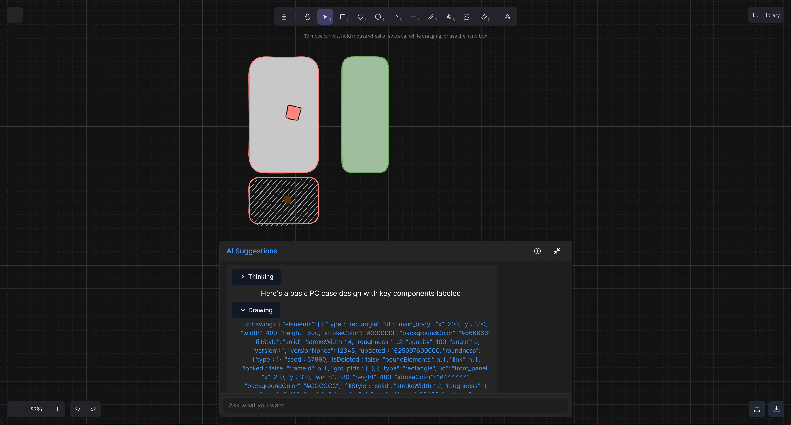
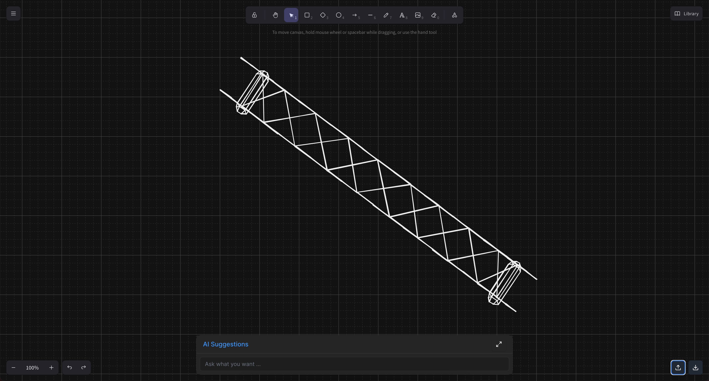

# XDRAW (Thinkers AI Drawing)

XDRAW is an intelligent CAD drawing application that combines the power of Excalidraw's intuitive drawing interface with AI assistance and DXF file support.

## Features

- **AI-Powered Drawing Assistant**: Integrated AI assistant helps users create and modify technical drawings through natural language interaction

- **DXF File Support**: Import and export DXF files for compatibility with professional CAD software

- **Interactive Drawing Canvas**: Built on Excalidraw for a smooth, responsive drawing experience
- **Real-time Collaboration**: Modern React-based architecture supporting real-time updates
- **Intelligent Toolbar**: Quick access to essential drawing tools and file operations

## Technology Stack

- **Drawing Engine**: Excalidraw
- **CAD Support**: DXF Parser/Writer
- **AI Integration**: OpenAI API

## Getting Started

1. Install dependencies:
```bash
npm install
```

2. Start the development server:
```bash
npm run dev
```

3. Start the API server:
```bash
node server/index.js
```

## Environment Variables

Create a `.env` file with the following variables:

```
OPENAI_API_KEY=your_api_key
OPENAI_BASE_URL=your_api_base_url
```

## Building for Production

```bash
npm run build
```

## License

MIT
